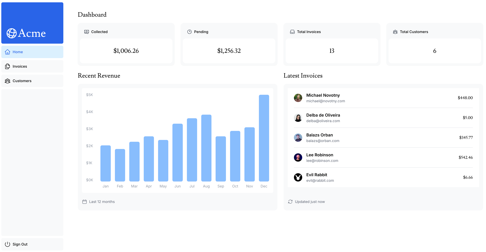
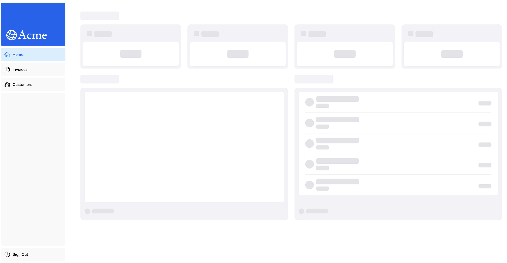

This is a [Next.js](https://nextjs.org/) project bootstrapped with [`create-next-app`](https://github.com/vercel/next.js/tree/canary/packages/create-next-app).

## Getting Started

```bash
npm run dev
```

Open [http://localhost:3000](http://localhost:3000) with your browser to see the result.

You can start editing the page by modifying `app/page.tsx`. The page auto-updates as you edit the file.

This project uses [`next/font`](https://nextjs.org/docs/basic-features/font-optimization) to automatically optimize and load Inter, a custom Google Font.

## 构建一个简化版本的财务仪表板

- 其内容包括：
  - 公共主页。
  - 登录页面。
  - 受身份验证保护的仪表板页面。
  - 用户可以添加、编辑和删除发票。

/dashboard



/dashboard（loading）


