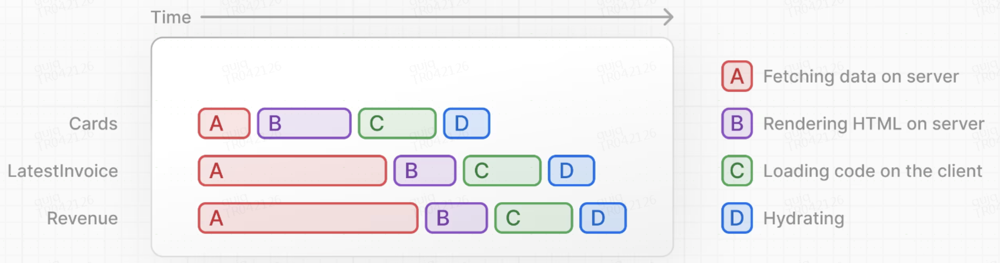

流式传输是一种数据传输技术，允许将路由分解为更小的“块”，并在它们准备就绪时逐步将它们从服务器流式传输到客户端。

可以防止缓慢的数据请求阻塞整个页面，显著减少页面的总体加载时间。用户可以查看页面的各个部分并与之交互，而无需等待所有数据加载完毕后才向用户显示任何 UI。

两种可以在 Next.js 中实现流式传输的方法：

1. 在页面级别，使用文件 `loading.tsx`
2. 对于特定组件，使用 `<Suspense>`

## 使用流式传输整个页面 `loading.tsx`

1. `loading.tsx `是一个基于 Suspense 构建的特殊 Next.js 文件，它允许创建后备 UI 以在页面内容加载时替代显示。
2. 由于 `<SideNav> `是静态的，所以会立即显示。用户可以在动态内容加载时与 `<SideNav> `进行交互。
3. 用户不必等待页面加载完毕即可离开（这称为可中断导航）。

#### 添加加载骨架

加载骨架是 UI 的简化版本。许多网站将其用作 **占位符** （或后备），以向用户指示内容正在加载。`loading.tsx` 添加的任何 UI 都将作为静态文件的一部分嵌入，并首先发送。然后，其余动态内容将从服务器流式传输到客户端。

#### 修复路由组加载骨架错误

由于在文件系统中 `loading.tsx `级别高于和 `/invoices/page.tsx 和 /customers/page.tsx`，因此也将应用于发票和客户页面。

可以用**路由组**将应用程序分成几个部分：在 `/dashboard` 文件夹中创建一个名为 `/(overview)` 的新文件夹。然后将 `loading.tsx `和 `page.tsx `文件移动到文件夹内。

路由组允许将文件组织成逻辑组，而不会影响 URL 路径结构。当使用括号 `()` 创建新文件夹时，名称不会包含在 URL 路径中。因此 `/dashboard/(overview)/page.tsx `等价于 `/dashboard`

## 流式传输组件

Suspense 允许推迟渲染应用程序的某些部分，直到满足某些条件（例如，数据已加载）。可以将动态组件包装在 Suspense 中。然后，在动态组件加载时向其传递一个后备组件以进行显示。

可以使用 Suspense 仅传输数据请求缓慢的组件并立即显示页面其余的 UI，而不是阻塞整个页面。

## 决定 Suspense 的边界

Suspense 的界限取决于以下几点：

1. 希望用户如何体验页面流动的过程。
2. 想要优先考虑哪些内容。
3. 组件是否依赖于数据获取。

- 可以流式传输**整个页面** `loading.tsx`...但如果其中一个组件的数据获取速度较慢，则可能会导致更长的加载时间。
- 可以单独流式传输 **每个组件** ......但这可能会导致 UI 在准备就绪时*弹出 *到屏幕上。
- 还可以通过流式传输**页面部分来创建 \***交错 \*效果。但需要创建包装器组件（分组组件）。

放置 Suspense 边界的位置将取决于应用程序。
一般来说，将数据提取移至需要它的组件，然后将这些组件包装在 Suspense 中。这允许流式传输特定组件并防止 UI 阻塞。
但如果应用程序需要，那么流式传输部分或整个页面也没有任何问题。

## 最终目标是改善用户的体验
